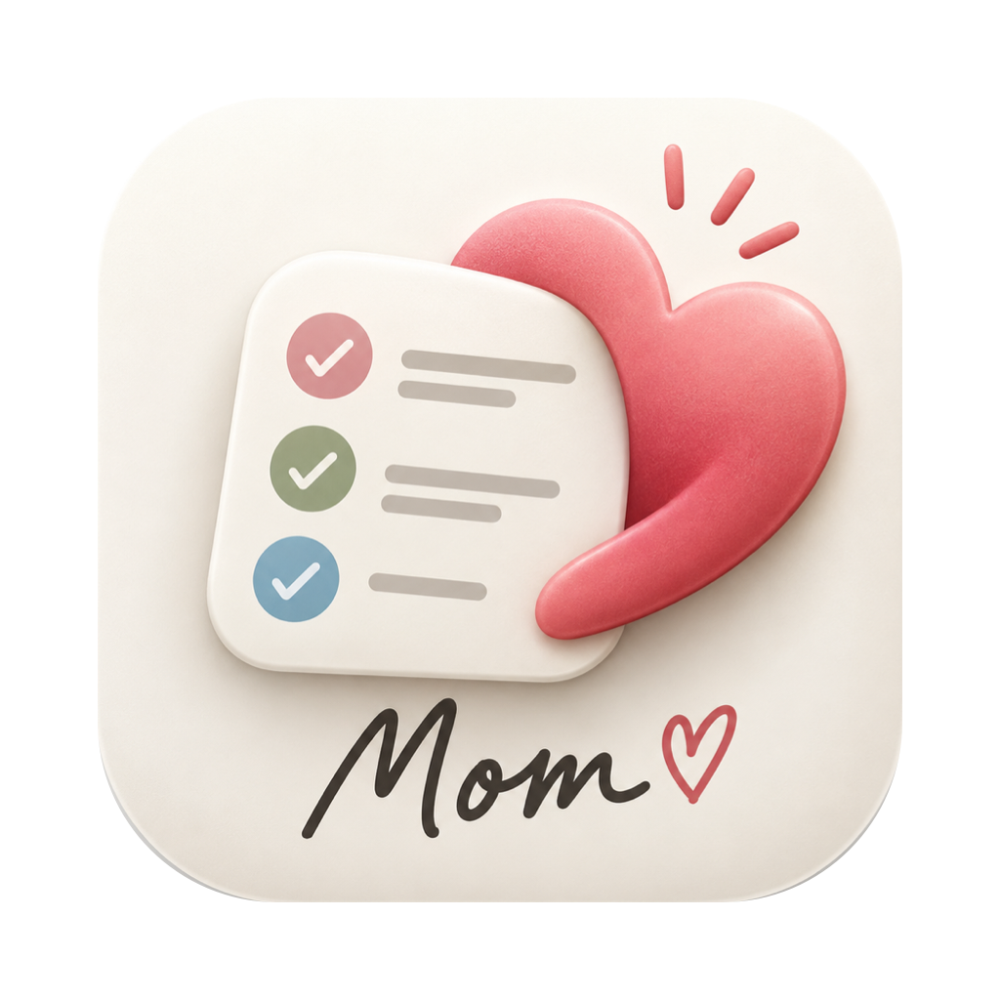

# Amma

A caring reminder in your Mac's notch: meals, water, medicine, eye rest, moving around — in her words, in 22 languages, with her photo and her recorded voice.

**[⬇ Download the latest version](https://github.com/sivachennai/amma/releases/latest)** — macOS 14 or newer, Apple silicon and Intel.

## Install
1. Open `Amma-1.0.dmg` and drag **Amma** into **Applications**.
2. Double-click Amma. macOS says it cannot be verified — click **Done** (not Move to Bin).
3. **System Settings → Privacy & Security**, scroll down, click **Open Anyway** next to "Amma was blocked", enter your password.

The warning appears because this build is not notarised by Apple yet.

## Privacy
Everything stays on your Mac. Nothing is sent anywhere.

---
Free to download and use. © 2026 Siva. All rights reserved.
